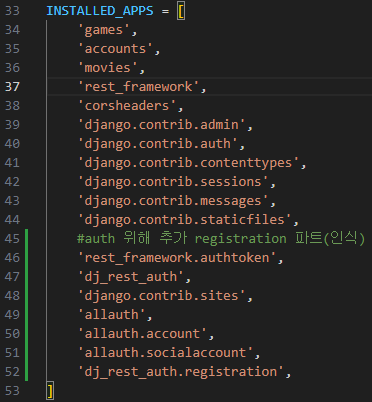
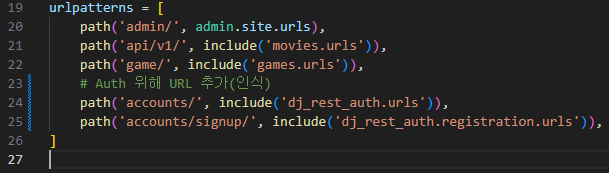
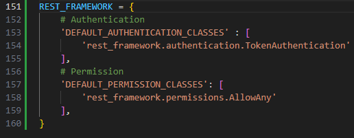
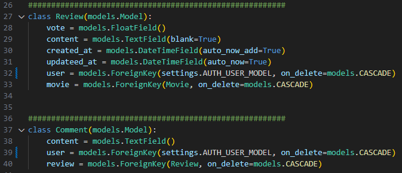
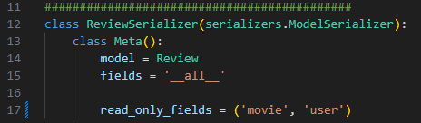
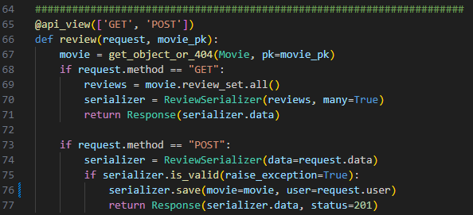
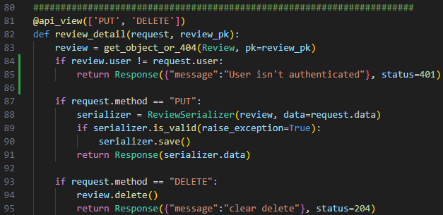

### Auth

**책임자: 권인식**

### 

### 23/05/19

---

**오후 12:00**

[install]

dj-rest-auth 패키지 설치

requirements.txt에 dj-rest-auth 항목 freeze


[accounts: settings.py]


L46) INSTALLED_APPS에 rest_framework.authtoken 등록

L47) INSTALLED_APPS에 'dj_rest_auth' 등록


---

**오후 1:45**

[install]

'dj-rest-auth[with_social]' 패키지 설치(''도 함께 써야 함)

requirements.txt에 'dj-rest-auth[with_social]' 항목 freeze


[accounts: settings.py]

L48) INSTALLED_APPS에 django.contrib.sites 등록

L49) INSTALLED_APPS에 allauth 등록

L50) INSTALLED_APPS에 allauth.account 등록

L51) INSTALLED_APPS에 allauth.socialaccount 등록

L52) INSTALLED_APPS에 dj_rest_auth.registration 등록



---

**오후 1:50**

[accounts: url.py]

accounts를 다루기 위한 Frame Wokr에서 제공하는 페이지 추가

L23) Auth 위해 URL 추가(인식) -- 주석

L24) path('accounts/', include('dj_rest_auth.urls')) URL 추가

L25) path('accounts/signup/', include('dj_rest_auth.registration.urls')) URL 추가




---

**오후 2:30**

[accounts: settings.py]

L151) REST_FRAMEWORK 추가

L153-154) Authentication => 인증 방식

L156-158) Permission => 접근 허가




---

**오후 3:30**

[movies: models.py]

L32) user = models.ForeignKey(settings.AUTH_USER_MODEL, on_delete=models.CASCADE)

L39) user = models.ForeignKey(settings.AUTH_USER_MODEL, on_delete=models.CASCADE)

=> 게시글 작성자의 user data를 저장할 table 추가




---

**오후 4:00**

[movies: serializers.py]

L17) read_only_fields = ('mvie', <mark>'user'</mark>) => user추가




---

**오후 4:30**

[movies: views.py]

L76)serializer.save(movie=movie, <mark>user=request.user</mark>)

review를 작성하는 유저의 정보를 저장




L84-85)

```python
if review.user != request.user:
    return Response({"message":"User isn't authenticated"}, status=401)
```

review를 작성한 user의 정보와 삭제를 요청하는 user의 정보가 다를 때는 권한이 없다는 message와 함께 status 401(unauthenticated) 출력


if 문을 통과하지 않고 다음 if 문으로 갔을 때는 원하는 요청사항 반영해서 review 수정


