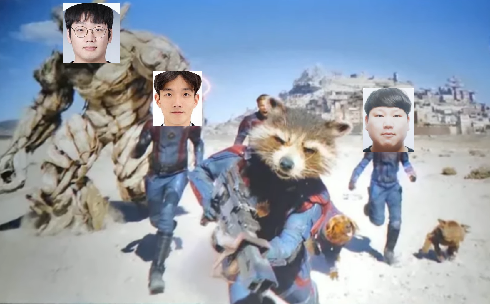
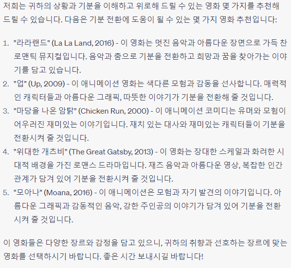
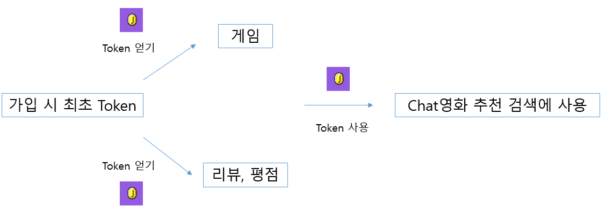

# Final Project(작성자 권인식)

## TEAM K2L1    Member 권인식 이세울 김성현

### 1. 팀원 정보 및 업무 분담 내역

> ### 팀원 정보

- 팀장 및 PM: 권인식

- 팀원: 이세울, 김성현

> ### 팀원 업무 분담 내역

- 기획 및 UI/UX디자인: 권인식(Main), 

- Back - End
  
  - ERD 및 DB 구성 - 김성현Main, 권인식, 이세울 Assistant
  
  - Model & Serializer 및 View - 김성현, 권인식 Main 이세울 Assistant

- Front - End
  
  - Auth & Ajax - Axios Front 내부 알고리즘 - 권인식 Main
  
  - 화면 기능 구성(Search bar 및 CSS와 부트스트랩을 사용한 기능 디자인) - 이세울 Main

- 발표 및 PPT 제작 - 권인식

### 2. 목표 서비스 구현 및 실제 구현 정도

> ### 서비스 개요

- 서비스 이름: Orbit

- 기획 컨셉: Chat-GPT기반의 영화 추천 서비스와 오락식을 결합한 멀티플렉스 환경 구축

- 기술 스택: Python, Django REST Framework, Vue, JavaScript, Postman

- 협업 툴: Git, Git LAB, Jira

- 배포: AWS

> ### 서비스 구현 목표

1. Home 화면
- Chat-GPT3.5 모델을 기반으로한 맞춤형 영화 추천 서비스 구현
  
  - 사용자가 입력한 정보를 기반으로 사용자에게 알맞는 영화를 추천해주는 것을 목표
  
  - 예시)
    
    Q: 오늘 좋지 않은 일이 있었는데 어떻게 하면 좋을까 ㅜㅜ
    
    A:
    
    

- TMDB(영화 정보 사이트) API를 통해 영화 정보 DB(약 1만개)를 가져온 뒤 위 답변에 속해있는 영화 정보를 제공
  
  - 영화 제목
  
  - 영화 포스터
  
  - 영화 줄거리
  
  - 영화 출시일
  
  - 장르
  
  - 평점(TMDB)
    
    - 평점(Orbit 이용자) 또한 제공
  
  - 유명도
2. Community 화면
- 5가지 알고리즘에 기반한 영화 리스트 sort
  
  - Top 100 (TMDB평점 기반)
  
  - 장르
  
  - 수익
  
  - 자체 평점
  
  - 랜덤

- Oribit 내 DB에서 찾고자 하는 영화 검색 Bar
  
  - input Search Bar를 통해 영화 검색 및 출력
3. Detail 화면
- 영화 정보 나타내기
  
  - poster
  
  - title
  
  - release_date
  
  - genre
  
  - vote_average(TMDB)
  
  - vote_average(Orbit)

- 리뷰 쓰기
  
  - Create
  
  - Read
  
  - Update
  
  - Delete

- 평점 남기기
  
  - 별점
1. Game 화면
- 여러 게임 리스트 넣기
  
  - 2048
  
  - 테트리스
  
  - Snake
  
  - Orbit 게임
4. Accounts(Profile) 화면
- 사용자 정보
  
  - Front
    
    - 닉네임
    
    - 썸네일(이모티콘, 사진)
    
    - Game Money
  
  - Back
    
    - ID
    
    - 비밀번호
    
    - 토큰

> ### 서비스 구현 흐름도

### 3. 데이터베이스 모델링 (ERD)

### 4. 영화 추천 알고리즘에 대한 기술적 설명

### 5. 서비스 대표 기능에 대한 설명

### 6. 배포 서버 URL (배포했을 경우)

### 7. 기타 (느낀 점, 후기)
